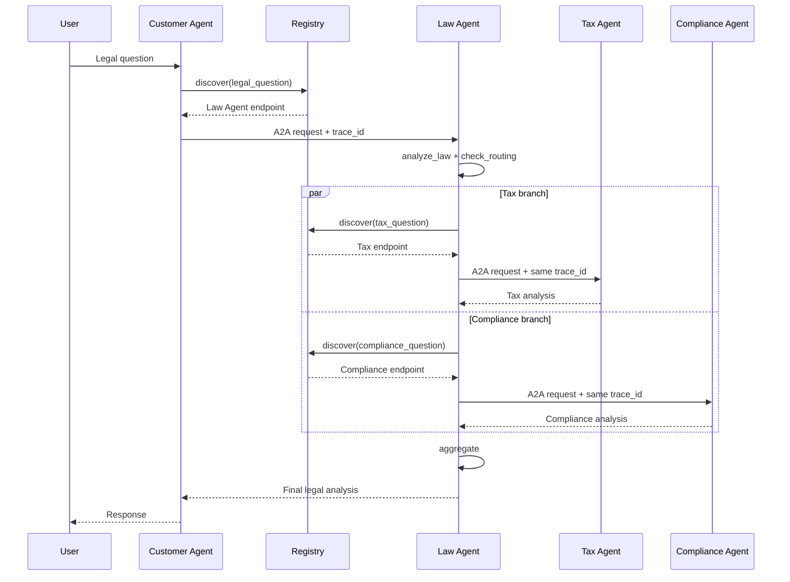

# Kết Quả Codelab

## Phần 1

1. `get_llm()` tạo `ChatOpenAI` dùng OpenRouter, model lấy từ
   `OPENROUTER_MODEL`, API key lấy từ `OPENROUTER_API_KEY`, và
   `temperature=0.3`.
2. Request gồm một `SystemMessage` định nghĩa vai trò/quy tắc và một
   `HumanMessage` chứa câu hỏi.
3. System message giữ hành vi của model nhất quán; human message biểu diễn yêu
   cầu cụ thể của người dùng.

## Phần 2

- `@tool` biến Python function thành tool có schema để LLM gọi.
- `LEGAL_KNOWLEDGE` là danh sách entry gồm `id`, `keywords`, và `text`.
- `llm.bind_tools(TOOLS)` gắn schemas của tools vào LLM.
- Đã thêm knowledge về luật lao động và tool
  `check_statute_of_limitations`.

## Phần 3

- `create_react_agent()` quản lý vòng lặp Reasoning, Acting, Observation.
- Stage 2 tự thực thi tool calls; Stage 3 để graph tự lặp đến khi có kết quả.
- Đã thêm `search_case_law` và test case breach of contract.
- LangGraph đang dùng không nhận `verbose=True`; `debug=True` cùng
  `astream(..., stream_mode="updates")` hiển thị chi tiết quá trình tương ứng.

## Phần 4

- Shared state là `LegalState`.
- Specialist agents được dispatch song song bằng danh sách `Send`.
- Đã thêm `privacy_agent`, state fields, aggregation, node, edge, và routing
  theo `data`, `privacy`, `gdpr`, `dữ liệu`.

## Phần 5

### Request flow

Nếu Tax Agent dừng, Registry discovery hoặc A2A call thất bại. `call_tax()`
bắt exception và trả placeholder `Tax analysis unavailable`; nhánh compliance
và bước tổng hợp vẫn tiếp tục.

Tax Agent đã được chỉnh prompt để trả lời bằng bullet ngắn, tối đa 180 từ.

## Câu Hỏi Ôn Tập

1. Dùng single agent khi domain hẹp, workflow ngắn, latency/cost quan trọng và
   không cần specialist độc lập.
2. A2A bổ sung contract dành cho agent như Agent Card, discovery, task/message
   semantics, metadata context và khả năng tương tác giữa implementation khác
   nhau. REST/gRPC chỉ cung cấp transport/RPC chung.
3. Truyền delegation depth hoặc visited-agent list, đặt giới hạn hop/time,
   deduplicate task ID, và từ chối delegation khi vượt ngưỡng.
4. Registry hỗ trợ discovery động, health-aware routing và thay endpoint mà
   không redeploy caller. Có thể hardcode URL cho demo nhỏ nhưng coupling cao
   và khó scale/failover.

## Latency

`test_client.py` hiện in end-to-end latency bằng `perf_counter()`. Hệ thống đã
giảm latency bằng cách chạy Tax và Compliance agents song song qua `Send`;
thời gian fan-out gần bằng nhánh chậm nhất thay vì tổng thời gian hai nhánh.
Con số thực tế phụ thuộc model, mạng và tải OpenRouter, nên cần chạy full system
để ghi nhận kết quả tại môi trường hiện tại. Lần xác minh này chưa lấy được số
đo full system vì OpenRouter trả HTTP 402 do credit còn lại không đủ cho chuỗi
nhiều LLM calls.
