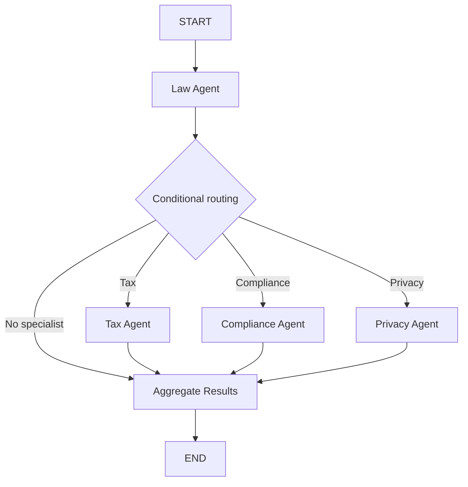
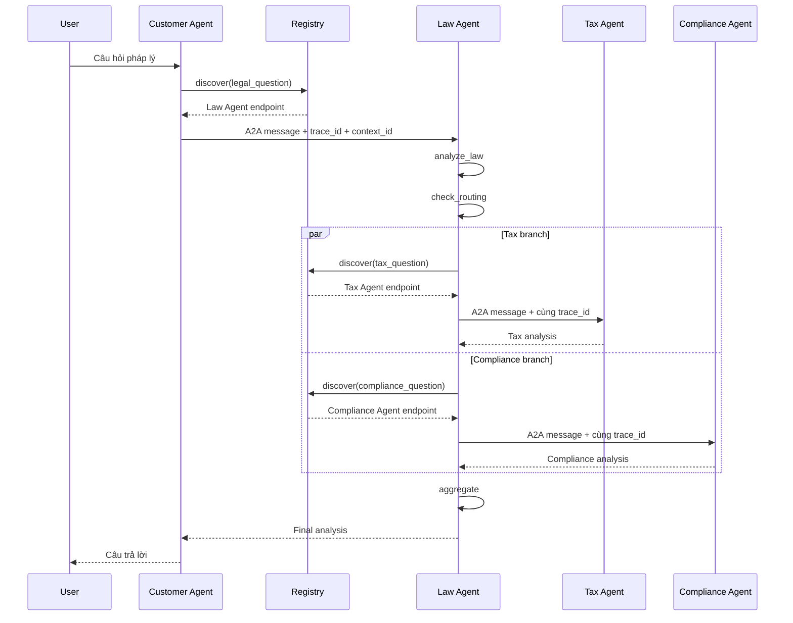

# Lab Solution: Multi-Agent với LangGraph và A2A

Tài liệu này trình bày lời giải cho các bài thực hành trong `CODELAB.md`.
Các đoạn code đầy đủ đã được cập nhật trực tiếp trong repository.

> Lưu ý: Nội dung pháp lý trong project chỉ phục vụ mục đích học tập.

## Chuẩn bị

Tạo file `.env`:

```env
OPENROUTER_API_KEY=your_key_here
OPENROUTER_MODEL=openai/gpt-oss-120b:free
OPENROUTER_MAX_TOKENS=1024
REGISTRY_URL=http://localhost:10000
```

Cài dependency:

```bash
uv sync
```

---

## Phần 1: Direct LLM Calling

### Câu hỏi lý thuyết

**1. LLM được khởi tạo như thế nào?**

Hàm `get_llm()` trong `common/llm.py` tạo một `ChatOpenAI` client và trỏ
endpoint tới OpenRouter:

```python
def get_llm() -> ChatOpenAI:
    return ChatOpenAI(
        model=os.getenv("OPENROUTER_MODEL", "openai/gpt-oss-120b:free"),
        temperature=0.3,
        max_tokens=int(os.getenv("OPENROUTER_MAX_TOKENS", "1024")),
        openai_api_key=os.getenv("OPENROUTER_API_KEY"),
        openai_api_base="https://openrouter.ai/api/v1",
    )
```

`ChatOpenAI` được dùng vì OpenRouter cung cấp API tương thích OpenAI. Model
thực tế không bắt buộc phải là model của OpenAI.

**2. Message gửi đến LLM có cấu trúc gì?**

```python
messages = [
    SystemMessage(content="Bạn là chuyên gia pháp lý..."),
    HumanMessage(content=QUESTION),
]
```

- `SystemMessage`: định nghĩa vai trò, quy tắc và cách trả lời.
- `HumanMessage`: chứa câu hỏi cụ thể của người dùng.

**3. Tại sao cần hai loại message?**

`SystemMessage` giúp hành vi của model nhất quán giữa các request.
`HumanMessage` tách yêu cầu người dùng khỏi instruction cấp hệ thống.

### Bài 1.1: Đổi câu hỏi

```python
QUESTION = (
    "Theo pháp luật Việt Nam, người lao động có thể làm gì khi bị "
    "đơn phương chấm dứt hợp đồng lao động trái pháp luật?"
)
```

### Bài 1.2: Temperature

Đã thêm:

```python
temperature=0.3
```

Temperature thấp giúp output ổn định hơn, phù hợp với phân tích pháp lý và
tool calling.

### Chạy kiểm tra

```bash
uv run python stages/stage_1_direct_llm/main.py
```

---

## Phần 2: LLM, RAG và Tools

### Câu hỏi lý thuyết

**1. `@tool` dùng ở đâu?**

Decorator `@tool` được đặt trước các Python function để LangChain tạo tool
schema cho LLM:

```python
@tool
def search_legal_database(query: str) -> str:
    ...
```

**2. `LEGAL_KNOWLEDGE` có cấu trúc gì?**

Đây là danh sách các dictionary:

```python
{
    "id": "labor_law",
    "keywords": ["lao động", "sa thải"],
    "text": "Nội dung pháp lý..."
}
```

**3. LLM được bind với tools thế nào?**

```python
llm_with_tools = llm.bind_tools(TOOLS)
```

LangChain chuyển type hints và docstring của tool thành schema để model biết
tên tool, chức năng và tham số cần truyền.

### Bài 2.1: Thêm luật lao động

```python
{
    "id": "labor_law",
    "keywords": [
        "lao động",
        "sa thải",
        "hợp đồng lao động",
        "labor",
        "termination",
    ],
    "text": (
        "Theo Bộ luật Lao động Việt Nam 2019, người sử dụng lao động có thể "
        "đơn phương chấm dứt hợp đồng trong các trường hợp: (1) người lao động "
        "thường xuyên không hoàn thành công việc; (2) bị ốm đau, tai nạn đã điều "
        "trị 12 tháng chưa khỏi; (3) thiên tai, hỏa hoạn; "
        "(4) người lao động đủ tuổi nghỉ hưu."
    ),
}
```

Phép tìm kiếm:

```python
overlap = sum(keyword in query_lower for keyword in entry["keywords"])
```

`True` được tính là `1`, `False` được tính là `0`. Entry có nhiều keyword
khớp hơn sẽ có điểm cao hơn.

### Bài 2.2: Tool kiểm tra thời hiệu

```python
@tool
def check_statute_of_limitations(case_type: str) -> str:
    """Kiểm tra thời hiệu khởi kiện theo loại vụ án."""
    limits = {
        "contract": "4 năm (UCC § 2-725)",
        "tort": "2-3 năm tùy bang",
        "property": "5 năm",
    }
    return limits.get(case_type.lower(), "Không xác định")
```

Đăng ký tool:

```python
TOOLS = [
    search_legal_database,
    calculate_damages,
    check_statute_of_limitations,
]
```

Thực thi tool call theo tên:

```python
tool_map = {registered_tool.name: registered_tool for registered_tool in tools}
selected_tool = tool_map.get(tool_call["name"])
tool_result = selected_tool.invoke(tool_call["args"])
```

### Chạy kiểm tra

```bash
uv run python stages/stage_2_rag_tools/main.py
uv run python exercises/exercise_2_tools.py
```

Kết quả mong đợi:

```text
Tool: check_statute_of_limitations
Args: {"case_type": "contract"}
Result: 4 năm (UCC § 2-725)
```

---

## Phần 3: Single Agent với ReAct

### So sánh Stage 2 và Stage 3

| Stage 2 | Stage 3 |
|---|---|
| Tự viết vòng lặp tool call | Agent tự quản lý vòng lặp |
| Chỉ một lượt tool call | Có thể gọi nhiều tools liên tiếp |
| Orchestration thủ công | ReAct orchestration |

### Bài 3.1: Tool tra cứu án lệ

```python
@tool
def search_case_law(keywords: str) -> str:
    """Tìm kiếm án lệ theo từ khóa."""
    cases = {
        "breach": "Hadley v. Baxendale (1854) - Consequential damages",
        "negligence": "Donoghue v. Stevenson (1932) - Duty of care",
        "contract": (
            "Carlill v. Carbolic Smoke Ball Co (1893) "
            "- Unilateral contract"
        ),
    }
    for key, case in cases.items():
        if key in keywords.lower():
            return case
    return "Không tìm thấy án lệ phù hợp"
```

Đăng ký:

```python
TOOLS = [
    search_legal_database,
    calculate_penalty,
    check_compliance_requirements,
    search_case_law,
]
```

Câu hỏi test:

```python
QUESTION = (
    "A supplier committed a breach of contract that caused foreseeable "
    "downstream losses. What remedies and relevant case law apply?"
)
```

### Bài 3.2: Debug reasoning

Phiên bản LangGraph trong project không hỗ trợ tham số `verbose=True`.
Thay vào đó sử dụng:

```python
graph = create_react_agent(
    model=llm,
    tools=TOOLS,
    prompt=SYSTEM_PROMPT,
    debug=True,
)
```

Kết hợp streaming:

```python
async for chunk in graph.astream(inputs, stream_mode="updates"):
    ...
```

Cách này cho phép quan sát:

```text
THINK + ACT -> OBSERVE -> FINAL ANSWER
```

### Chạy kiểm tra

```bash
uv run python stages/stage_3_single_agent/main.py
```

---

## Phần 4: Multi-Agent In-Process

### Shared state

```python
class State(TypedDict):
    question: str
    law_analysis: Annotated[str, _last_wins]
    tax_analysis: Annotated[str, _last_wins]
    compliance_analysis: Annotated[str, _last_wins]
    privacy_analysis: Annotated[str, _last_wins]
    final_response: str
```

Reducer `_last_wins` giúp xử lý việc nhiều nhánh song song ghi vào state:

```python
def _last_wins(left: str | None, right: str | None) -> str:
    return right if right is not None else (left or "")
```

### Bài 4.1: Privacy Agent

```python
def privacy_agent(state: State) -> dict:
    llm = get_llm()
    prompt = f"""Bạn là chuyên gia về GDPR và luật bảo vệ dữ liệu cá nhân.

Câu hỏi gốc: {state['question']}
Phân tích pháp lý: {state.get('law_analysis', 'N/A')}

Hãy phân tích các vấn đề về GDPR, data protection, privacy rights
và data breach.
"""
    response = llm.invoke([HumanMessage(content=prompt)])
    return {"privacy_analysis": response.content}
```

Thêm vào bước tổng hợp:

```python
if state.get("privacy_analysis"):
    sections.append(
        f"PHÂN TÍCH QUYỀN RIÊNG TƯ:\n{state['privacy_analysis']}"
    )
```

### Bài 4.2: Conditional routing

```python
def check_routing(state: State) -> list[Send]:
    question_lower = state["question"].lower()
    tasks = []

    if any(kw in question_lower for kw in ["tax", "irs", "thuế"]):
        tasks.append(Send("tax_agent", state))

    if any(
        kw in question_lower
        for kw in ["compliance", "sec", "regulation"]
    ):
        tasks.append(Send("compliance_agent", state))

    if any(
        kw in question_lower
        for kw in ["data", "privacy", "gdpr", "dữ liệu"]
    ):
        tasks.append(Send("privacy_agent", state))

    return tasks if tasks else [Send("aggregate_results", state)]
```

Xây graph:

```python
graph.add_node("privacy_agent", privacy_agent)

graph.add_conditional_edges(
    "law_agent",
    check_routing,
    ["tax_agent", "compliance_agent", "privacy_agent", "aggregate_results"],
)

graph.add_edge("privacy_agent", "aggregate_results")
```

### Sơ đồ



### Chạy kiểm tra

```bash
uv run python stages/stage_4_milti_agent/main.py
uv run python exercises/exercise_4_multiagent.py
```

---

## Phần 5: Distributed A2A System

### Khởi động

Terminal 1:

```bash
./start_all.sh
```

Terminal 2:

```bash
uv run python test_client.py
```

Hoặc chạy giao diện:

```bash
uv run python -m demo_ui
```

Sau đó mở `http://localhost:8080`.

### Bài 5.1: Trace request flow



Các metadata quan trọng:

```python
metadata={
    "trace_id": trace_id,
    "context_id": context_id,
    "delegation_depth": depth,
}
```

- `trace_id`: liên kết log của toàn bộ request.
- `context_id`: định danh ngữ cảnh A2A.
- `delegation_depth`: ngăn agent gọi lẫn nhau vô hạn.

### Bài 5.2: Dynamic discovery

Khi Tax Agent bị dừng:

1. Law Agent gọi Registry để tìm task `tax_question`.
2. Nếu không tìm thấy endpoint hoặc request lỗi, `call_tax()` bắt exception.
3. State nhận placeholder:

```text
[Tax analysis unavailable: ...]
```

4. Nhánh Compliance vẫn có thể hoàn thành.
5. Aggregator vẫn tạo câu trả lời nhưng ghi rõ phần Tax không khả dụng.

Đây là graceful degradation: một specialist lỗi không nhất thiết làm hỏng toàn
bộ workflow.

### Bài 5.3: Rút gọn Tax Agent

System prompt đã được chỉnh:

```python
Answer concisely in no more than 180 words.
Use short bullets, avoid repeating the question, and end with a
one-sentence educational-purpose disclaimer.
```

Ngoài ra, tất cả agent nhận instruction dùng chung:

```python
VIETNAMESE_RESPONSE_INSTRUCTION = """
QUY TẮC NGÔN NGỮ BẮT BUỘC:
- Luôn trả lời bằng tiếng Việt, kể cả khi câu hỏi được viết bằng ngôn ngữ khác.
- Có thể giữ nguyên tên riêng, tên đạo luật, án lệ và thuật ngữ chuyên ngành,
  nhưng phải giải thích nội dung chính bằng tiếng Việt.
"""
```

Sau khi sửa agent, cần restart service:

```bash
# Dừng hệ thống cũ bằng Ctrl+C
./start_all.sh
```

---

## Bài cộng điểm: Đo và giảm latency

### Đo latency

`test_client.py` sử dụng:

```python
from time import perf_counter

started_at = perf_counter()
response = await client.send_message(request)
elapsed = perf_counter() - started_at

print(f"End-to-end latency: {elapsed:.2f} seconds")
```

Latency cần được đo từ lúc client gửi A2A request cho tới khi nhận response
cuối cùng.

### Phương án giảm latency

Giải pháp chính đã áp dụng là chạy Tax Agent và Compliance Agent song song bằng
`Send`:

```python
def route_to_subagents(state: LawState) -> list[Send]:
    sends = []

    if state.get("needs_tax"):
        sends.append(Send("call_tax", state))

    if state.get("needs_compliance"):
        sends.append(Send("call_compliance", state))

    return sends if sends else [Send("aggregate", state)]
```

Giả sử:

```text
Tax Agent        = 12 giây
Compliance Agent = 10 giây
```

Nếu chạy tuần tự:

```text
12 + 10 = khoảng 22 giây
```

Nếu chạy song song:

```text
max(12, 10) = khoảng 12 giây
```

Các phương án bổ sung:

1. Dùng model có latency thấp hơn.
2. Giảm `OPENROUTER_MAX_TOKENS`.
3. Rút gọn system prompt.
4. Chỉ gọi specialist thực sự cần thiết.
5. Cache Agent Card và kết quả Registry discovery.
6. Tái sử dụng HTTP client thay vì tạo connection mới mỗi lần.
7. Stream partial response về giao diện.

Giao diện Stage 5 hiển thị chi tiết:

- Registry latency.
- Health-check latency của từng agent.
- A2A delegation latency.
- Tổng end-to-end latency.
- `trace_id`, `context_id` và delegation depth.

---

## Câu hỏi ôn tập

### 1. Khi nào nên dùng single agent?

Dùng single agent khi:

- Domain hẹp.
- Workflow ngắn.
- Không cần nhiều chuyên gia độc lập.
- Latency và chi phí quan trọng hơn khả năng mở rộng.
- Một agent có thể quản lý toàn bộ tools mà không làm prompt quá phức tạp.

### 2. A2A khác REST hoặc gRPC thế nào?

REST và gRPC là cơ chế giao tiếp chung. A2A bổ sung các khái niệm dành riêng
cho agent:

- Agent Card.
- Capability và skill discovery.
- Task và Message semantics.
- Context, trace và metadata propagation.
- Giao tiếp giữa agent được xây bằng framework hoặc ngôn ngữ khác nhau.

A2A vẫn có thể sử dụng HTTP làm transport.

### 3. Làm sao ngăn infinite delegation loop?

- Giới hạn `delegation_depth`.
- Lưu danh sách agent đã đi qua.
- Đặt timeout và maximum hops.
- Deduplicate theo task ID hoặc message ID.
- Không cho agent delegate ngược lại agent cha khi không cần thiết.

Project sử dụng:

```python
MAX_DELEGATION_DEPTH = 3
```

### 4. Tại sao cần Registry?

Registry giúp:

- Tìm agent theo capability hoặc task.
- Thay endpoint mà không sửa caller.
- Hỗ trợ scale nhiều instance.
- Chuẩn bị cho health-aware routing và failover.

Có thể hardcode URL trong demo nhỏ, nhưng cách đó tạo coupling cao và khó vận
hành khi hệ thống mở rộng.

---

## Kiểm tra nhanh toàn bộ bài

```bash
# Syntax
.venv/bin/python -m compileall -q \
  common customer_agent law_agent tax_agent compliance_agent \
  stages exercises demo_ui test_client.py

# Stage 1-4
uv run python stages/stage_1_direct_llm/main.py
uv run python stages/stage_2_rag_tools/main.py
uv run python stages/stage_3_single_agent/main.py
uv run python stages/stage_4_milti_agent/main.py

# Exercise files
uv run python exercises/exercise_2_tools.py
uv run python exercises/exercise_4_multiagent.py

# Stage 5
./start_all.sh
uv run python test_client.py

# Stage 5 UI
uv run python -m demo_ui
```

## File lời giải liên quan

- `common/llm.py`
- `stages/stage_1_direct_llm/main.py`
- `stages/stage_2_rag_tools/main.py`
- `stages/stage_3_single_agent/main.py`
- `stages/stage_4_milti_agent/main.py`
- `exercises/exercise_2_tools.py`
- `exercises/exercise_4_multiagent.py`
- `law_agent/graph.py`
- `tax_agent/graph.py`
- `test_client.py`
- `demo_ui/`
