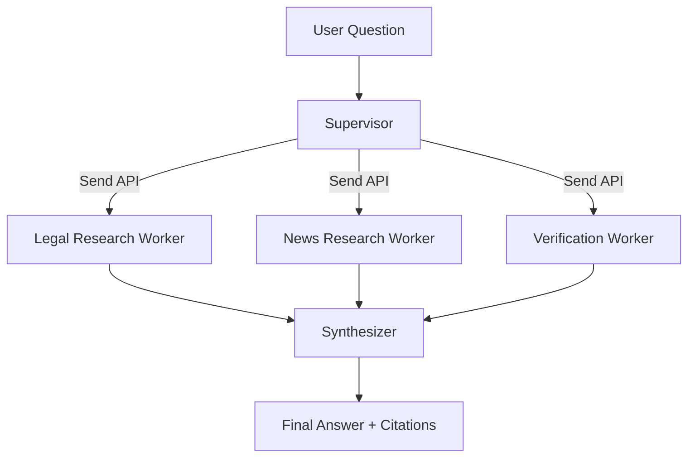

# Báo Cáo Thực Hiện Lab Assignment Day 09

## 1. Yêu cầu

Cải tiến bài Day 08 RAG Pipeline theo pattern **Supervisor - Workers**, sử dụng
ít nhất 2-3 workers và đặt toàn bộ source code trong folder `Lab_Assignment`.

## 2. Những thay đổi đã thực hiện

### Giữ lại RAG Pipeline Day 08

Các thành phần cũ tiếp tục được giữ:

- Thu thập văn bản pháp luật.
- Crawl bài báo.
- Chuyển đổi tài liệu sang Markdown.
- Chunking và indexing.
- Semantic search.
- BM25 lexical search.
- RRF reranking.
- PageIndex fallback.
- Generation có citation.

Lớp Supervisor-Workers mới được xây dựng phía trên corpus và retrieval pipeline
đã có.

## 3. Kiến trúc Supervisor - Workers



LangGraph thực tế:

```text
START
  |
  v
Supervisor
  |
  +--> Legal Research Worker --------+
  +--> News Research Worker ---------+--> Synthesizer --> END
  +--> Verification Worker ----------+
```

Ba workers được dispatch song song bằng LangGraph `Send` API.

## 4. Vai trò của từng Agent

### Supervisor

Nhiệm vụ:

- Nhận câu hỏi người dùng.
- Phân rã câu hỏi thành các nhiệm vụ chuyên biệt.
- Tạo danh sách workers cần thực thi.
- Dispatch ba workers song song.

Kế hoạch mặc định:

```python
plan = [
    "legal_worker",
    "news_worker",
    "verification_worker",
]
```

### Legal Research Worker

Nhiệm vụ:

- Chỉ tìm kiếm trong corpus pháp luật.
- Truy xuất điều luật, hình phạt và quy định có liên quan.
- Trả về evidence kèm tên nguồn và score.

Nguồn dữ liệu:

```text
data/standardized/legal/
```

### News Research Worker

Nhiệm vụ:

- Chỉ tìm kiếm trong corpus tin tức.
- Tìm các sự kiện và bài báo liên quan đến câu hỏi.
- Trả về evidence kèm nguồn tin.

Nguồn dữ liệu:

```text
data/standardized/news/
```

### Verification Worker

Nhiệm vụ:

- Tìm kiếm độc lập trên toàn bộ corpus.
- Kiểm tra evidence có nguồn pháp luật hay không.
- Kiểm tra evidence có đến từ nhiều tài liệu hay không.
- Tạo cảnh báo nếu nguồn chưa đủ hoặc thiếu đa dạng.

Ví dụ cảnh báo:

```text
Chưa có nguồn pháp luật trong nhóm bằng chứng.
Bằng chứng chỉ đến từ một tài liệu.
```

### Synthesizer

Nhiệm vụ:

- Nhận kết quả từ cả ba workers.
- Loại bỏ evidence trùng lặp.
- Sắp xếp evidence theo score.
- Tạo câu trả lời cuối bằng tiếng Việt.
- Gắn citation theo tên file nguồn.
- Thông báo rõ khi evidence không đủ.

## 5. Shared State và Reducer

State chính:

```python
class SupervisorState(TypedDict):
    question: str
    plan: list[WorkerName]
    worker_results: Annotated[list[WorkerResult], operator.add]
    logs: Annotated[list[str], operator.add]
    final_answer: str
```

Hai trường sau sử dụng reducer `operator.add`:

```python
worker_results: Annotated[list[WorkerResult], operator.add]
logs: Annotated[list[str], operator.add]
```

Reducer cho phép các nhánh song song cùng ghi kết quả vào state mà không xảy ra
lỗi concurrent update.

## 6. Retrieval Offline

Đã bổ sung retrieval nhẹ để bài có thể chạy ngay mà không cần:

- Tải lại embedding model BGE-M3.
- Kết nối OpenAI hoặc OpenRouter.
- Rebuild ChromaDB.

Quy trình:

```text
Query
  |
  v
Tokenize
  |
  v
Đọc Markdown corpus
  |
  v
Chunk theo paragraph và word-aligned overlap
  |
  v
Tính normalized token overlap
  |
  v
Sort theo score
```

Hàm chính:

```python
local_search(
    query,
    document_type="legal" | "news" | None,
    top_k=4,
)
```

Mỗi evidence có cấu trúc:

```python
{
    "content": "...",
    "score": 0.83,
    "source": "bo-luat-hinh-su-2017.md",
    "document_type": "legal",
}
```

## 7. Hai chế độ tổng hợp

### Offline mode

Đây là chế độ mặc định:

```env
SUPERVISOR_USE_LLM=false
```

Ưu điểm:

- Không cần API key.
- Không cần Internet.
- Chạy nhanh.
- Dễ kiểm thử tự động.
- Câu trả lời chỉ sử dụng evidence đã truy xuất.

### OpenRouter mode

Để dùng LLM cho bước tổng hợp:

```env
OPENROUTER_API_KEY=your_key_here
OPENROUTER_MODEL=openai/gpt-oss-120b:free
OPENROUTER_MAX_TOKENS=1200
SUPERVISOR_USE_LLM=true
```

LLM được yêu cầu:

- Luôn trả lời bằng tiếng Việt.
- Chỉ dùng evidence được cung cấp.
- Mọi nhận định phải có citation.
- Không được tự đoán nếu thiếu evidence.

## 8. Các file đã thêm

### `src/supervisor_workers.py`

Chứa toàn bộ:

- State schema.
- Supervisor.
- Ba workers.
- Retrieval offline.
- Synthesizer.
- LangGraph construction.
- Hàm chạy end-to-end.

### `run_supervisor.py`

CLI để chạy demo:

```bash
.venv/bin/python Lab_Assignment/run_supervisor.py
```

Hoặc truyền câu hỏi:

```bash
.venv/bin/python Lab_Assignment/run_supervisor.py \
  "Hình phạt đối với hành vi tàng trữ trái phép chất ma túy?"
```

CLI hiển thị:

- Supervisor plan.
- Execution log.
- Kết quả của từng worker.
- Final answer.

### `tests/test_supervisor_workers.py`

Gồm ba automated tests:

1. Kiểm tra graph có Supervisor, ba workers và Synthesizer.
2. Kiểm tra retrieval sử dụng được corpus hiện có.
3. Kiểm tra workflow end-to-end trả đủ ba worker results và final answer.

### `.env.example`

Chứa cấu hình mẫu cho offline mode và OpenRouter mode.

### `.gitignore`

Loại bỏ:

- `.env`
- `__pycache__`
- Python bytecode.
- `.DS_Store`
- ChromaDB generated files.

## 9. Các file đã cập nhật

### `Lab_Assignment/README.md`

Đã thêm:

- Mô tả assignment Day 09.
- Kiến trúc Supervisor-Workers.
- Vai trò từng worker.
- Hướng dẫn chạy.
- Hướng dẫn test.

### `Lab_Assignment/SUMMARY.md`

Đã thêm:

- Tóm tắt phần cải tiến Day 09.
- Kết quả test.
- Lệnh demo.

### `Lab_Assignment/requirements.txt`

Đã bổ sung:

```text
langgraph
langchain-core
langchain-openai
```

### README của repository

Đã thêm link tới:

```text
Lab_Assignment/
```

## 10. Kết quả kiểm thử

Lệnh kiểm thử:

```bash
.venv/bin/python -m unittest \
  Lab_Assignment.tests.test_supervisor_workers -v
```

Kết quả:

```text
test_end_to_end_offline ... ok
test_graph_contains_supervisor_and_three_workers ... ok
test_local_search_uses_existing_corpus ... ok

Ran 3 tests
OK
```

Compile check:

```bash
.venv/bin/python -m compileall -q \
  Lab_Assignment/src \
  Lab_Assignment/run_supervisor.py \
  Lab_Assignment/tests
```

Kết quả: không có syntax error.

## 11. Kết quả chạy thực tế

Supervisor plan:

```text
- legal_worker
- news_worker
- verification_worker
```

Worker results:

```text
Legal Worker: tìm thấy 4 evidence pháp luật.
News Worker: tìm thấy 4 evidence tin tức.
Verification Worker: kiểm tra 6 evidence từ nhiều tài liệu.
```

Synthesizer tạo final answer chứa:

- Câu hỏi gốc.
- Danh sách evidence.
- Citation theo file nguồn.
- Score retrieval.
- Kết luận và cảnh báo kiểm chứng.

## 12. Cách demo trên lớp

### Bước 1: Giới thiệu kiến trúc

Trình bày graph:

```text
Supervisor -> 3 Workers chạy song song -> Synthesizer
```

### Bước 2: Chạy test

```bash
.venv/bin/python -m unittest \
  Lab_Assignment.tests.test_supervisor_workers -v
```

### Bước 3: Chạy CLI

```bash
.venv/bin/python Lab_Assignment/run_supervisor.py
```

### Bước 4: Giải thích output

- Supervisor tạo ba nhiệm vụ.
- Workers chạy song song bằng `Send`.
- Reducer gom kết quả.
- Verification Worker kiểm tra chất lượng nguồn.
- Synthesizer tạo câu trả lời có citation.

## 13. Kết luận

Bài Day 08 ban đầu là một RAG pipeline tuần tự. Sau khi cải tiến, hệ thống đã
trở thành multi-agent workflow theo pattern Supervisor-Workers:

- Có một Supervisor điều phối.
- Có ba workers chuyên môn hóa.
- Workers được chạy song song.
- Có bước kiểm chứng độc lập.
- Có bước tổng hợp câu trả lời cuối.
- Có citation và cảnh báo thiếu evidence.
- Có thể chạy offline hoặc dùng OpenRouter.
- Có automated tests để xác minh graph và workflow.

## 14. Giao diện web

Đã bổ sung UI tại:

```text
Lab_Assignment/ui/
```

Chạy:

```bash
.venv/bin/python -m Lab_Assignment.ui
```

Mở `http://localhost:8090`.

UI sử dụng FastAPI và NDJSON streaming để cập nhật graph theo thời gian thực.
Các khu vực chính:

- Agent topology.
- Execution log.
- Worker evidence theo tab.
- Verification warnings.
- Final synthesized answer.
- Mode, latency, số evidence và số nguồn.

UI hỗ trợ hai chế độ:

- Offline synthesis.
- OpenRouter synthesis nếu có API key.
